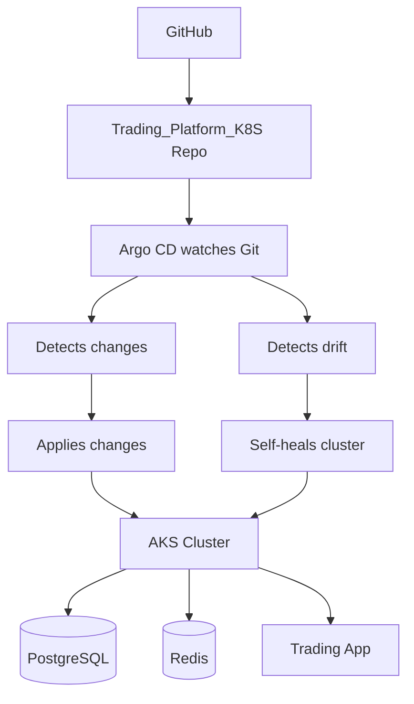

# Trading Platform K8S

A Kubernetes-deployed trading application with PostgreSQL database backend.

## Project Overview

This project sets up a complete trading platform infrastructure using Kubernetes, including:
- PostgreSQL database deployment
- Trading application microservice
- Namespace isolation for the trading app

## Prerequisites

- Docker
- Kubernetes cluster (Minikube, Docker Desktop K8S, or cloud provider)
- kubectl CLI
- IntelliJ IDEA 2024.3.5 (for development)

## Setup Instructions

### 1. Create Namespace

```bash
kubectl apply -f namespaces/trading-app.yaml
````

2. Deploy PostgreSQL
   kubectl apply -f postgres/deployment.yaml
   kubectl apply -f postgres/service.yaml

3. Deploy Trading Application
   kubectl apply -f trading-app/deployment.yaml
   kubectl apply -f trading-app/service.yaml

# Trading Platform — K8S GitOps Deployment
GitOps-driven deployment pipeline for the Trading Platform application, using **Argo CD** to continuously sync and self-heal an **Azure Kubernetes Service (AKS)** cluster from this repository.

## Architecture
This project follows a GitOps deployment model: the cluster's desired state lives entirely in Git, and Argo CD keeps AKS in sync with it automatically.

**How it works:**
1. Kubernetes manifests / Helm charts are pushed to this repo (`Trading_Platform_K8S`).
2. Argo CD continuously watches the repo for changes.
3. **On change:** Argo CD automatically applies the updated manifests to AKS.
4. **On drift** (e.g. someone manually edits a resource in the cluster): Argo CD detects the mismatch and self-heals, reverting the cluster back to match Git.
5. AKS runs the three core workloads: **PostgreSQL** (database), **Redis** (caching/session store), and the **Trading App** (Spring Boot backend).

## Setup

1. **Install Argo CD** on your AKS cluster (skip if already installed):
```bash
   kubectl create namespace argocd
   kubectl apply -n argocd -f https://raw.githubusercontent.com/argoproj/argo-cd/stable/manifests/install.yaml
```

2. **Point Argo CD at this repo** by applying the Application manifest:
```bash
   kubectl apply -f argocd/trading-app.yaml
```

3. **Verify sync status:**
```bash
   argocd app get trading-app
   argocd app sync trading-app
```

4. Argo CD will now automatically apply any future changes pushed to this repo, and self-heal the cluster if it drifts from the desired state.

## CI/CD Flow

- **CI (Github Actions):** builds and tests the Trading App, then pushes a new image and updates the manifest/tag in this repo.
- **CD (Argo CD):** picks up the manifest change and rolls it out to AKS — no manual `kubectl apply` needed.
---

# Important Commands
```
# Check cluster status
kubectl get nodes

# List all resources in trading-app namespace
kubectl get all -n trading-app

# View deployments
kubectl get deployments -n trading-app

# View pods
kubectl get pods -n trading-app

# View services
kubectl get svc -n trading-app

# View PostgreSQL logs
kubectl logs -n trading-app deployment/postgres

# View trading-app logs
kubectl logs -n trading-app deployment/trading-app

# Describe deployment
kubectl describe deployment postgres -n trading-app

# Port forward to PostgreSQL
kubectl port-forward -n trading-app svc/postgres 5432:5432

# Port forward to trading-app
kubectl port-forward -n trading-app svc/trading-app 8080:8080

# Connect to PostgreSQL pod
kubectl exec -it -n trading-app <pod-name> -- psql -U postgres -d trading_db

# Database credentials
# Username: postgres
# Password: user123
# Database: trading_db
# Port: 5432


